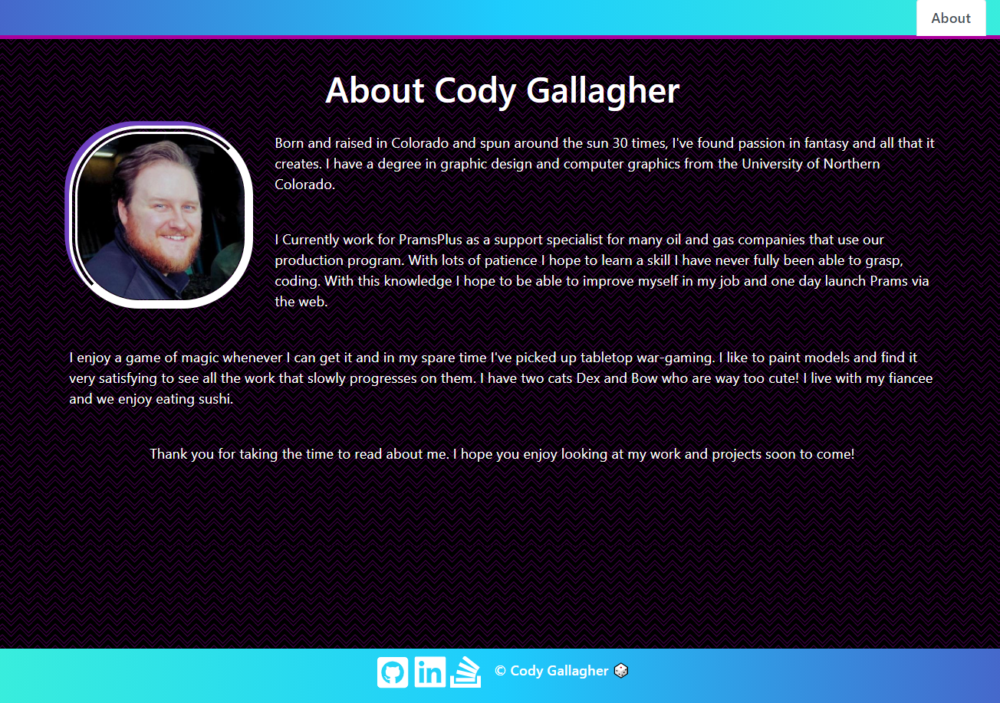

# 20 React portfolio

## Description

This website will be the refactor of the pure html and css portfolio earlier in the bootcamp. 

The site contains an about me, contact, project, and resume page. 

In the footer there are links to the github, linked-in, and stack overflow profiles for me. 

## Table of Contents
- [Description](#description)
- [Installation](#installation)
- [Usage](#usage)
- [License](#license)
- [Contributors](#contributors)
- [Tests](#tests)
- [Contact](#contact)

## Installation

There are no files to download for this project.

The packages required to run are:

- axios
- bootstrap
- dotenv
- react
- react-bootstrap
- react-dom
- react-icons
- react-scripts
- web-vitals

## Usage

To start the process, go to the deployed site [here](https://codyg-2021.github.io/20-React-Portfolio/)

To go offline open up the dev tools by inspecting the page. 

Go to application and with the "Update on reload" checked. Select the offline button and refresh the page. You are now offline, enter data and then uncheck offline and refresh. You should see your data is still there and now apart of the database. 

## License

Source link for [MIT](https://opensource.org/licenses/MIT)

## Contributors

Cody Gallagher

## Tests

There are currently no tests for this application.  

## Contact

[GitHub Profile](https://github.com/CodyG-2021)

Email Me -- gallagher2021@gmail.com